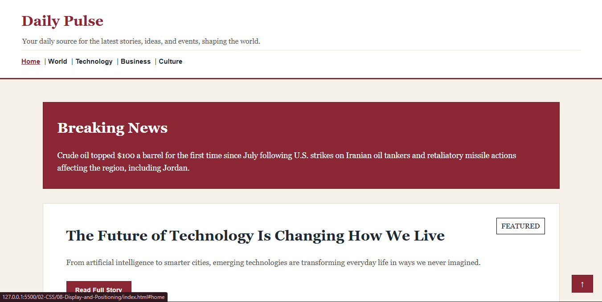
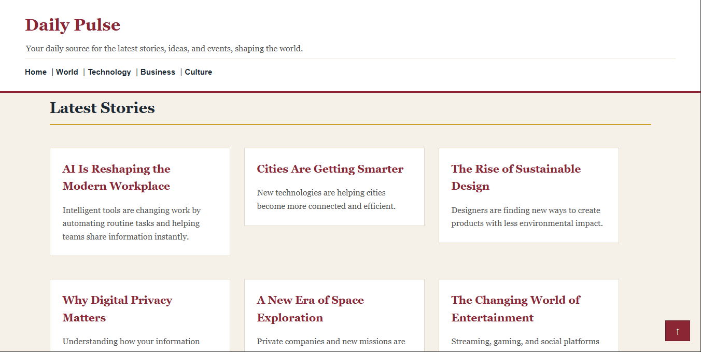
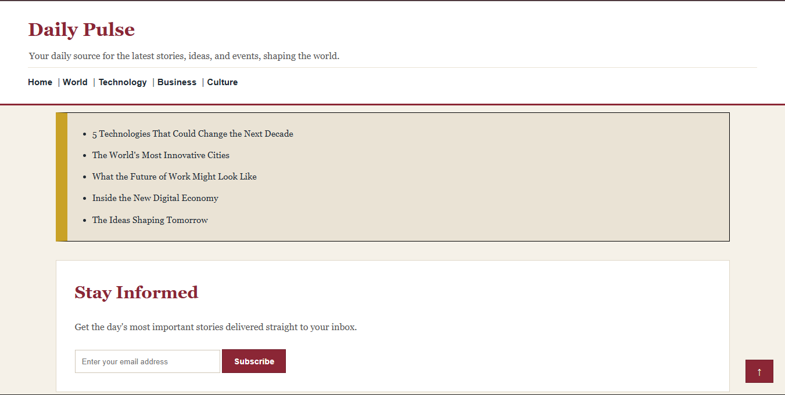
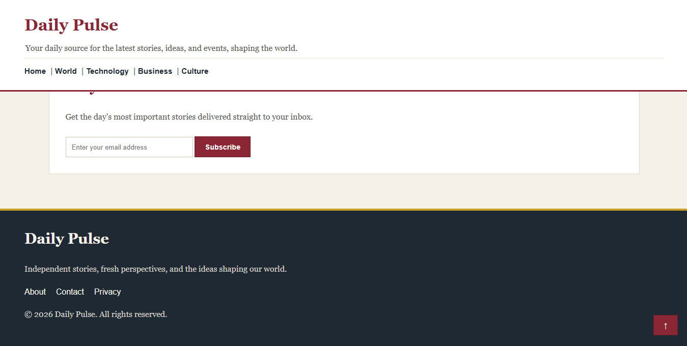

# 📰 Daily Pulse - Magzine Homepage

A modern magzine and news homepage built as part of my **CSS Learning Journey**.

This project focuses on understanding how CSS **Display** and **Positioning** properties work in real-world layouts while combining concepts learned in previous CSS modules.


## 🌐 Live Demo

🔗 **[View Live Website](https://daily-pulse-magzine.netlify.app/)**


## 📸Project Overview

<!-- Add Screenshot -->





---

## Module 08 - Display and Positioning 

### Concepts Practiced

- `display: block`
- `display: inline`
- `display: inline-block`
- `display: none`
- `position: static`
- `position: relative`
- `position: absolute`
- `position: fixed`
- `position: sticky`
- `z-index`

--- 
## Features

- Modern magzine-style homepage 
- Sticky header navigation
- Breaking news section
- Featured story section
- Latest stories
- Newsletter subscription section
- Fixed back to top button
- Absolute positioned featured label 
- Classical editorial color palette

---
## 🎨 Color Palette

| color | Usage |
|------|------|
| `#F5F1E8` | Main Background |
| `#1F2933` | Primary Text |
| `#8B2635` | Primary Accent |
| `#C9A227` | Secondary Accent |
| `#FFFFFF` | Cards & Sections |
| `#EAE3D5` | Secondary Background |

---

## 🧠Previous Concepts Applied 

This project also combines knowledge from previous CSS modules: 

- CSS Fundamentals
- Selectors 
- Cascade & Specificity 
- Box Model 
- Units & Sizing 
- Typography 
- Colors & Backgrounds

---

## 📁Project Structure

```text
Daily Pulse
|
├── cheat-sheet.md
|  
├── images/
|        ├── first.png
|        ├── second.png
|        ├── third.png
|        └── fourth.png
|
├── index.html 
├── style.css 
└── README.md

```

## 🎓Learning Goal 

The goal of this project was to practically understand how CSS display types and positioning work by applying them to real-world magzine homepage.

## 👨‍💻Author 

**Umar Noon**

Part of my **Web Development From Scratch** learning journey.